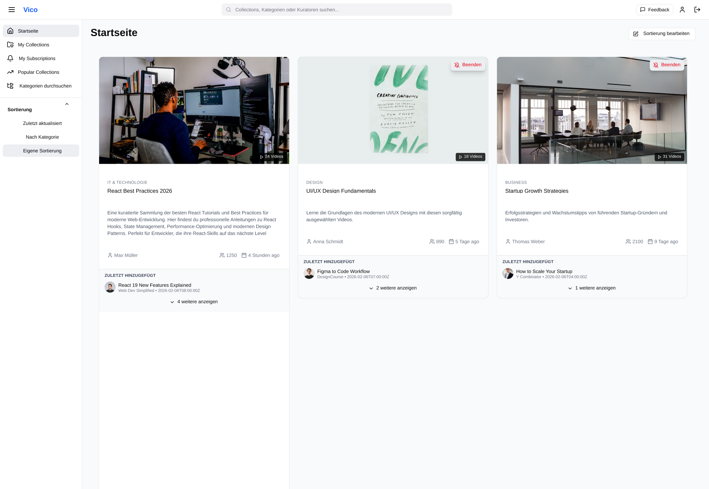

# Vico

Vico (*VideoCollections*) ist ein privates Fullstack-Projekt mit dem Ziel, YouTube-Inhalte bewusster, strukturierter und zielgerichteter zu konsumieren.  
Die konzeptionellen Grundlagen und die Motivation hinter dem Projekt sind in `docs/initialisierung.md` dokumentiert.

Neben der Entwicklung eines funktionsfähigen Produkts dient dieses Projekt primär als praktische Übung in moderner Fullstack-Anwendungsentwicklung. Der Fokus liegt dabei auf sauberer Architektur, klarer Trennung von Verantwortlichkeiten und nachhaltiger Codequalität. Einzelne technologische Entscheidungen werden bewusst nicht final festgelegt, um Raum für Exploration und Lernen zu lassen.

Backend-seitig kommt FastAPI zum Einsatz, während im Frontend mit TypeScript und verschiedenen Frameworks experimentiert wird. Ziel ist es, fundierte praktische Erfahrungen zu sammeln und unterschiedliche Ansätze zu evaluieren. Aktuell liegt der Schwerpunkt auf React in Kombination mit Next.js.

## UI-Prototyp

Der folgende Screenshot zeigt einen UI-Prototyp der Startseite für eingeloggte Nutzer.  
Dargestellt sind die eigenen, sowie die abonnierten Video-Collections, Ziel dieser Ansicht ist ein schneller Überblick und ein direkter Einstieg.

Die nächste Ansicht zeigt die Bearbeitung eines Collection-Filters.  
Über diese Oberfläche können Filterregeln definiert und angepasst werden, um Inhalte innerhalb einer Collection gezielt einzugrenzen und zu strukturieren.

